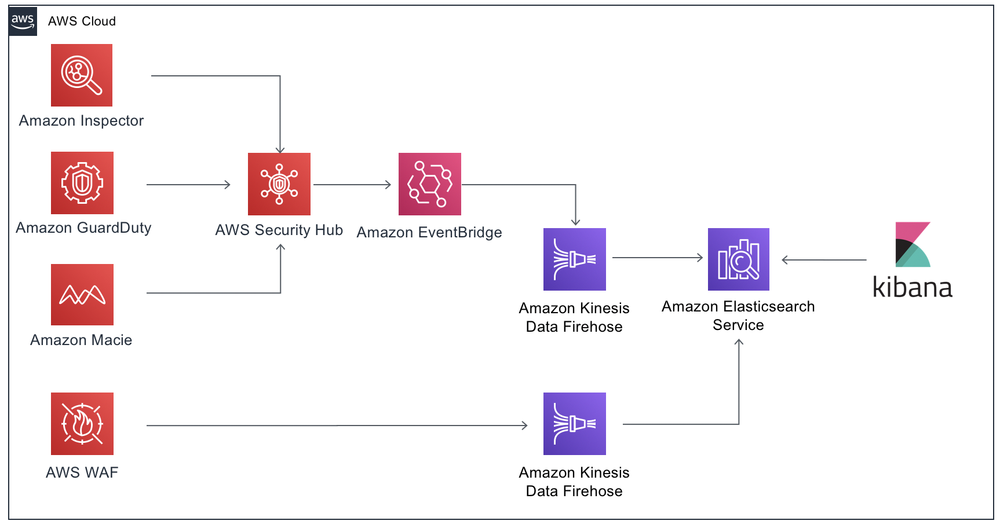

## Security Operation Center Dashboard using ElasticSearch Service

### Overview

To get started you will need an IAM user with the following access:

- AWS CloudFormation
- Amazon S3
- Amazon ElasticSearch Service
- Amazon Kinesis Data Firehose
- Amazon EventBridge

_Note: Tested in the N. Virginia region (us-east-1). But you can test in every region that has support for this services_
  

## Deploying Cloudformation template

1. Download the **deploy/template.yaml** file in your computer
2. Open the [Cloudformation](https://console.aws.amazon.com/cloudformation).
3. On the Welcome page, click on **Create stack** button.
4. On the Step 1 - Specify template: Choose Upload a template file, click on Choose file button and select the template.yaml.
5. On the Step 2 - Specify stack parameters: Enter the **DataNodeEBSVolumeSize**, **ElasticSearchDomainName**, **MasterUser** for the ElasticSearch Opendistro access, **MasterUserPass**, **NodeNumber** and **NodeType**.
6. On the Step 3 - Configure stack options: Just click on **Next** button.
7. On the Step 4 - Review: Enable the checkbox **I acknowledge that AWS CloudFormation might create IAM resources with custom names.**, and click on **Create Stack** button.
8. Wait for the stack get into status **CREATE_COMPLETE**.

## Configuring Firehose and ElasticSearch Service permissions on Kibana

1. Open [ElasticSearch Console](https://console.aws.amazon.com/es).
2. In **My Domains**, click in the domain created (e.g. soc-dashboard).
3. Click in **Overview tab** and click on endpoint on **Kibana** field.
4. In the new browser tab, in **Username** put the **MasterUser** parameter defined by you on Cloudformation deployment.
5. In **Password**, put the **MasterPass** parameter defined by you on Cloudformation deployment.
6. In the **Kibana** front end, go to **Security**.
7. Click in **Role Mappings**.
8. Click in **Edit** button on **all_access**.
9. In **Backend roles**, click on **Add Backend Role** button and insert two roles, on in each line:
   - arn:aws:iam::<ACCOUNT_ID>:role/admin
   - arn:aws:iam::<ACCOUNT_ID:role/<FIREHOSE_STREAM_IAMROLE> (this is the role used by Kinesis Firehose can deliver to ES Domain)

## Enabling Security Service

Now you can enable services such as Amazon Guardduty, Amazon Macie, AWS Security Hub and Amazon Inspector that will start to send findings to ElasticSearch domain.
You can also configure to [send AWS WAF Logs to the ElasticSearch domain](https://docs.aws.amazon.com/waf/latest/developerguide/logging.html#logging-management)

## Creating ES Index Patterns

Now that you have findings coming to your ElasticSearch Domain, you need to create an Index Patterns for 
each Firehose stream. In this case, you need to create index patterns for **sechub_index** and **waf_index**.

1. After you are logged into Kibana, go to **Stack Management**.
2. Click in **Index Patterns**.
3. Click in **Create index pattern**.
4. In the **Index pattern** box, type sechub_index* and click in **Next step**.
5. In the **Time Filter field name** drop-down, select **detail.findings.UpdatedAt** and click in **Create index pattern**.

_Repeat this steps for waf_index_ 

## Clean up

1. Open the [Cloudformation](https://console.aws.amazon.com/cloudformation).
2. Select the Stack and click on **Delete** button.

## Reference links

https://docs.aws.amazon.com/securityhub/latest/userguide/securityhub-settingup.html

https://docs.aws.amazon.com/macie/latest/userguide/macie-setting-up.html

https://docs.aws.amazon.com/guardduty/latest/ug/guardduty_settingup.html

https://aws.amazon.com/pt/premiumsupport/knowledge-center/set-up-amazon-inspector/ 

https://aws.amazon.com/pt/solutions/implementations/aws-waf-security-automations/

## License summary
This sample code is made available under the MIT-0 license. See the LICENSE file.
